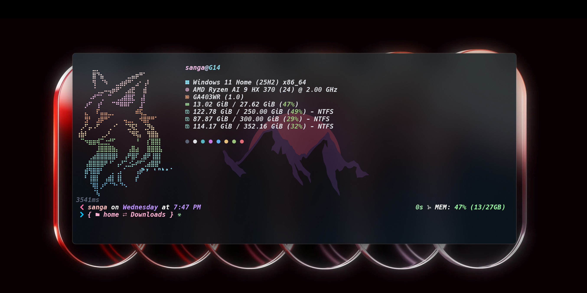

# 💻 Windows Terminal Configuration & Preview

This folder contains the Windows Terminal settings and configuration files to set up a beautiful, functional terminal environment with integrated system information display.

---

## 📸 Terminal UI Preview



**What You'll See:**
- Custom Oh-My-Posh prompt with git repository information
- Beautiful ASCII art visualization
- Real-time system metrics (CPU, RAM, Storage usage)
- OS and hardware information via Fastfetch
- Color-coded directory navigation with Terminal-Icons
- Modern dark theme with gradient effects

---

## 📋 Files in This Folder

- **Terminal_Settings.json** - Complete Windows Terminal configuration including theme, colors, fonts, and profiles
- **Terminal_preview.png** - Visual screenshot of the configured terminal UI

⚠️ **Important Disclaimer:**
Before using `Terminal_Settings.json`, you **MUST** replace any instances of `username` with your actual Windows username. The settings file may contain profile paths like `C:\Users\username\` which need to be updated to match your system. Failure to do this may cause errors or the settings not to apply correctly.

---

## 🔤 Font Requirement: Hack Nerd Font

This terminal configuration uses **Hack Nerd Font Bold Italic Mono** for optimal appearance and icon support.

### 📥 Hack Nerd Font Installation

#### Option 1: Download & Install Manually
1. Visit: [www.nerdfonts.com](https://www.nerdfonts.com)
2. Search for and download **Hack** font
3. Extract the ZIP file
4. Select all `.ttf` files
5. Right-click and select **Install for all users** (requires admin rights)
6. Or: Copy all `.ttf` files to `C:\Windows\Fonts\`

#### Option 2: Install via Scoop (Recommended)
```powershell
# First install Scoop if not already installed
iwr -useb get.scoop.sh | iex

# Then install Hack Nerd Font
scoop bucket add nerd-fonts
scoop install Hack-NF
```

#### Option 3: Install via Chocolatey
```powershell
# First install Chocolatey if not already installed
# (See https://chocolatey.org/install)

# Then install Hack Nerd Font
choco install nerd-fonts-hack -y
```

#### Option 4: Install via Windows Package Manager
```powershell
winget search Hack Nerd
winget install "Hack Nerd Font" --exact
```

### 🎯 Font Verification
After installation, verify the font is available:
```powershell
# List all installed fonts
[System.Reflection.Assembly]::LoadWithPartialName("System.Drawing") | Out-Null
$fonts = New-Object System.Drawing.Text.InstalledFontCollection
$fonts.Families | Where-Object { $_ -like "*Hack*" } | Select-Object Name
```

### 📝 Using Hack Nerd Font in Terminal Settings

In your `Terminal_Settings.json`, make sure the font is set to one of these variants:
- `Hack Nerd Font` - Standard weight
- `Hack Nerd Font Mono` - Monospace variant
- `Hack Nerd Font Bold Italic Mono` - **Bold Italic (Recommended for this setup)**

Example configuration:
```json
"fontFace": "Hack Nerd Font Bold Italic Mono",
"fontSize": 10
```

**Font Size Recommendations:**
- 10-11 for better code readability
- 12 for larger text
- Adjust based on your monitor and preference

### ⚠️ Alternative Fonts (If Hack Nerd Font Issues)

If Hack Nerd Font doesn't work or you prefer alternatives:
- **Fira Code Nerd Font**: Excellent for ligatures
- **JetBrains Mono Nerd Font**: Professional appearance
- **FiraCode Nerd Font**: Modern and clean
- **Cascadia Code Nerd Font**: Built-in Windows alternative

Install any of these using Scoop:
```powershell
scoop bucket add nerd-fonts
scoop install FiraCode-NF
scoop install JetBrainsMono-NF
scoop install CascadiaCode-NF
```

## ✅ Required Applications & Modules

To use the `Terminal_Settings.json` configuration without errors, you must install all the following applications and PowerShell modules:

### 🪟 Required Applications

1. **Windows Terminal**
   - Download from: Microsoft Store or [GitHub Releases](https://github.com/microsoft/terminal/releases)
   - Command: `winget install Microsoft.WindowsTerminal`
   - Required for the terminal shell and settings

2. **PowerShell 7+**
   - Download from: [pwsh.dev](https://pwsh.dev) or Microsoft Store
   - Command: `winget install Microsoft.PowerShell`
   - The core shell that runs all configurations

3. **Git**
   - Download from: [git-scm.com](https://git-scm.com)
   - Command: `winget install Git.Git`
   - Required for posh-git integration and repository information

4. **Fastfetch**
   - Download from: [github.com/fastfetch-cli/fastfetch](https://github.com/fastfetch-cli/fastfetch)
   - Command: `winget install fastfetch` or `scoop install fastfetch`
   - Displays system information (CPU, RAM, Storage, OS details)

### 📦 Required PowerShell Modules

Install all these modules using PowerShellGet:

```powershell
Install-Module -Name oh-my-posh, posh-git, PSFzf, Terminal-Icons, z -Scope CurrentUser -Force
```

**Or install individually:**

```powershell
# Prompt theme engine
Install-Module -Name oh-my-posh -Scope CurrentUser -Force

# Git integration
Install-Module -Name posh-git -Scope CurrentUser -Force

# Fuzzy finding and history search
Install-Module -Name PSFzf -Scope CurrentUser -Force

# File and folder icons
Install-Module -Name Terminal-Icons -Scope CurrentUser -Force

# Directory jumping/bookmarking
Install-Module -Name z -Scope CurrentUser -Force
```

**Alternative Installation (using Scoop):**
```powershell
scoop install oh-my-posh posh-git psreadline
```

**Alternative Installation (using Winget):**
```powershell
winget install JanDeDobbeleer.OhMyPosh
winget install dahlbyk.posh-git
winget install junegunn.fzf
```

### 📋 Module Descriptions

| Module | Purpose | Features |
|--------|---------|----------|
| **oh-my-posh** | Prompt theme engine | Customizable prompt segments, git status, time display, colors |
| **posh-git** | Git integration | Git branch/status in prompt, tab completion for git commands |
| **PSFzf** | Fuzzy finder | Ctrl+R history search, file/folder fuzzy finding |
| **Terminal-Icons** | Visual enhancements | File and folder icons in terminal output |
| **z** | Directory navigation | Quick jumping to frequently used directories |

---

## 🚀 Quick Start Installation

### Step 1: Install Required Applications
```powershell
# Windows Terminal
winget install Microsoft.WindowsTerminal

# PowerShell 7+
winget install Microsoft.PowerShell

# Git
winget install Git.Git

# Fastfetch
winget install fastfetch
```

### Step 2: Install PowerShell Modules
```powershell
Install-Module -Name oh-my-posh, posh-git, PSFzf, Terminal-Icons, z -Scope CurrentUser -Force
```

### Step 3: Copy Terminal Settings
```powershell
# IMPORTANT: Edit Terminal_Settings.json and replace 'username' with your actual Windows username
# before importing!

# Open Windows Terminal Settings
# Press: Ctrl + ,

# Then either:
# Option A: Copy-paste contents from Terminal_Settings.json into your settings.json
#          (Make sure to replace 'username' with your actual username first!)
# Option B: Use Settings → Import → Select Terminal_Settings.json
#          (Then edit to replace 'username' with your actual username)
```

### Step 4: Copy PowerShell Profile
```powershell
# Copy .config folder to your home directory
Copy-Item -Path "..\.config\*" -Destination "$env:USERPROFILE\.config" -Recurse -Force

# Verify profile path
$PROFILE
```

### Step 5: Restart Terminal
- Close and reopen Windows Terminal
- You should see the custom prompt with git info and Fastfetch output

---

## 🔧 Troubleshooting

### Modules Not Loading?
```powershell
# Check if modules are installed
Get-Module -ListAvailable | Select-Object Name

# Re-install if missing
Install-Module -Name ModuleName -Scope CurrentUser -Force
```

### Fastfetch Not Found?
```powershell
# Verify installation
fastfetch --version

# If not found, install it
winget install fastfetch
```

### Git Not Recognized?
```powershell
# Verify Git installation
git --version

# If not found, install it
winget install Git.Git

# Then restart PowerShell
```

### PowerShell Profile Not Loading?
```powershell
# Check execution policy
Get-ExecutionPolicy

# Set to RemoteSigned if needed
Set-ExecutionPolicy -ExecutionPolicy RemoteSigned -Scope CurrentUser

# Verify profile exists
Test-Path $PROFILE

# Create if not exists
if (!(Test-Path $PROFILE)) { New-Item -Path $PROFILE -Type File -Force }
```

### Permission Denied on Modules?
```powershell
# Run PowerShell as Administrator and run:
Install-Module -Name oh-my-posh, posh-git, PSFzf, Terminal-Icons, z -Scope CurrentUser -Force
```

---

## 🎨 What Gets Configured

The `Terminal_Settings.json` file includes:

- ✅ Custom color scheme with modern dark theme
- ✅ Default profile set to PowerShell 7
- ✅ Font configuration for optimal terminal display
- ✅ Transparency and acrylic effect settings
- ✅ Cursor style and appearance settings
- ✅ Tab width and scrollback history
- ✅ Startup directory configuration
- ✅ Custom keyboard shortcuts and actions

---

## 📚 Related Documentation

For more information, see:
- [Main README](../README.md) - Full repository overview
- [PowerShell Configuration](../PowerShell/README.md) - PowerShell-specific setup
- [Terminal GitHub](https://github.com/microsoft/terminal) - Official Windows Terminal repository

---

## 💡 Tips & Tricks

### Quick Navigation
```powershell
# Jump to frequently used folders
z ProjectFolder

# Go back to last directory
z -
```

### History Search
```powershell
# Fuzzy search command history
Ctrl + R

# Then type to filter
```

### Quick Terminal Reset
```powershell
# If things break, reset to defaults
Remove-Module posh-git
Remove-Module oh-my-posh
$PROFILE  # Check profile location
# Delete or edit the profile file
```

### Create an Alias
```powershell
# Add to your profile
Set-Alias -Name ll -Value Get-ChildItem
```

---

## 🙏 Credits

- **Windows Terminal**: [microsoft/terminal](https://github.com/microsoft/terminal)
- **Oh-My-Posh**: [JanDeDobbeleer/oh-my-posh](https://github.com/JanDeDobbeleer/oh-my-posh)
- **posh-git**: [dahlbyk/posh-git](https://github.com/dahlbyk/posh-git)
- **PSFzf**: [PowerShell module for fuzzy finding](https://github.com/kelleyma9/PSFzf)
- **Terminal-Icons**: [PowerShell module for icons](https://github.com/devblackops/Terminal-Icons)
- **Fastfetch**: [fastfetch-cli/fastfetch](https://github.com/fastfetch-cli/fastfetch)

---

**Last Updated:** April 2026 | **Maintained by:** [Codecity001](https://github.com/Codecity001)
