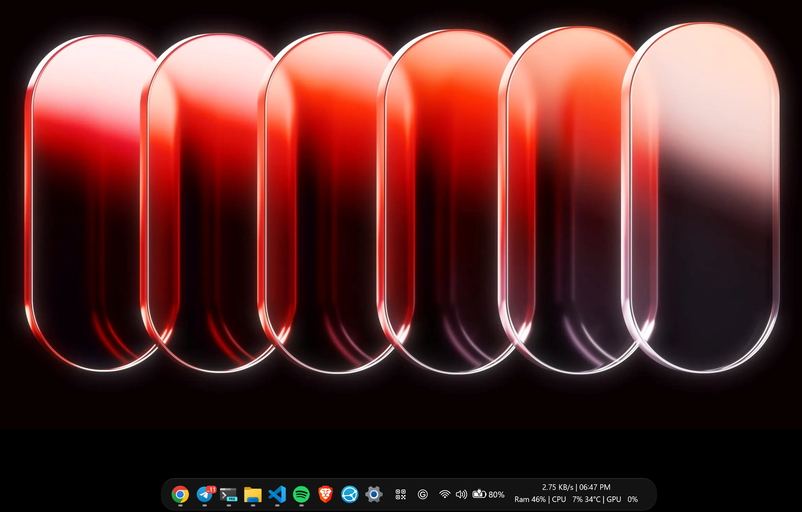
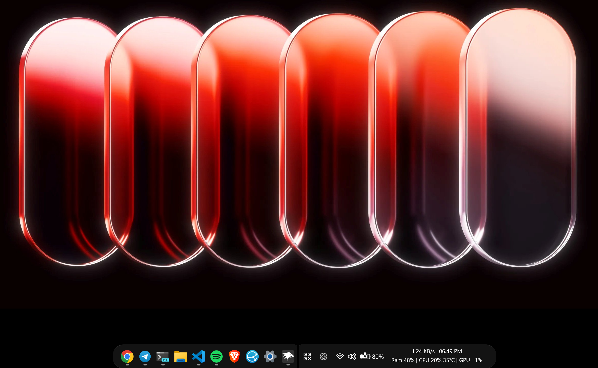
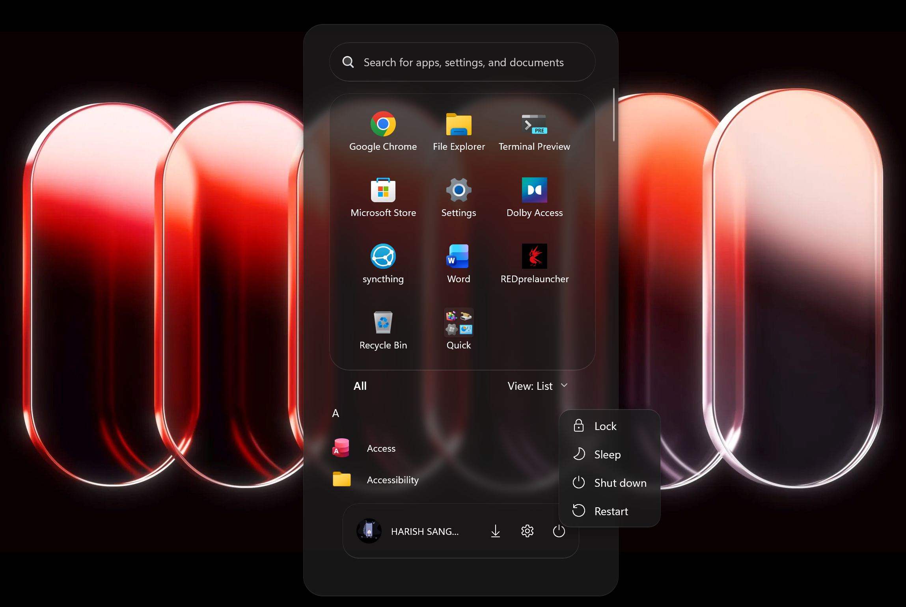
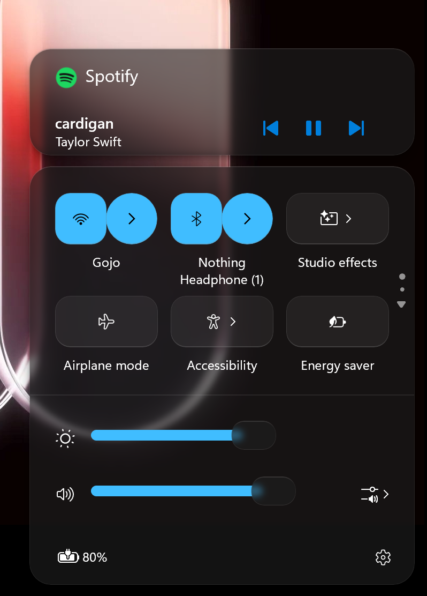

# 🎭 Windhawk Configuration Guide

Welcome to the Windhawk customization folder! This guide provides detailed information on how to use, install, and customize all the mods and configurations included in this repository.

## 📋 Table of Contents

- [What is Windhawk?](#what-is-windhawk)
- [Installation & Setup](#installation--setup)
- [Configuration Files Overview](#configuration-files-overview)
- [Mods & Configurations](#mods--configurations)
  - [Taskbar Customizations](#taskbar-customizations)
  - [Windows Glass Effects](#windows-glass-effects)
  - [File Explorer Enhancements](#file-explorer-enhancements)
- [How to Apply Configurations](#how-to-apply-configurations)
- [Troubleshooting](#troubleshooting)

---

## 🤔 What is Windhawk?

**Windhawk** is a powerful Windows customization engine that allows you to modify and enhance the appearance and behavior of Windows 11 through C++ mods written in the Windhawk scripting language. It provides:

- 🎨 **Visual Enhancements**: Glass effects, translucent windows, custom styling
- ⚡ **Performance Tweaks**: Customize system behavior and UI elements
- 🔧 **Easy Installation**: Simple one-click mod installation
- 🔄 **Live Updates**: Apply changes without restarting (in most cases)
- 💾 **Configuration Management**: Save and restore mod settings

**Official Website**: [ramensoftware.com/windhawk](https://ramensoftware.com/windhawk)

---

## 🚀 Installation & Setup

### Prerequisites

1. **Windows 11** (21H2 or later)
2. **Windhawk** - Download from [ramensoftware.com/windhawk](https://ramensoftware.com/windhawk)

### Step-by-Step Installation

1. **Download Windhawk**
   - Visit [ramensoftware.com/windhawk](https://ramensoftware.com/windhawk)
   - Click "Download" and run the installer
   - Follow the installation wizard

2. **Launch Windhawk**
   - After installation, Windhawk will appear in your system tray
   - Click the Windhawk icon to open the main window

3. **Install Mods from Repository**
   - In Windhawk, click **Menu** → **Explore**
   - Search for and install the following mods:
     1. **Better file sizes in Explorer details**
     2. **Taskbar Clock Customization**
     3. **Taskbar height and icon size**
     4. **Translucent Windows**
     5. **Windows 11 File Explorer Styler**
     6. **Windows 11 Notification Center Styler**
     7. **Windows 11 Start Menu Styler**
     8. **Windows 11 Taskbar Styler**

4. **Apply Configuration Settings**
   - For each installed mod, open its settings
   - Navigate to the **Advanced** tab
   - Copy the content from the respective `.json` file in this folder
   - Paste the JSON configuration into the **Advanced** tab
   - Click **Save** or **Apply**

5. **Enable Mods**
   - Toggle the switch next to each mod to enable/disable it
   - Changes take effect immediately or after a refresh

---

## 📁 Configuration Files Overview

This folder contains two types of configuration files:

### **JSON Files** (Primary Format)
- **Format**: JSON (JavaScript Object Notation)
- **Purpose**: Store mod configurations and settings
- **Usage**: Paste into Windhawk mod's **Advanced** tab
- **Customizable**: Yes - edit settings by opening the JSON file in a text editor

### **YAML Files** (Alternative Format)
- **Format**: YAML (YAML Ain't Markup Language)
- **Purpose**: Alternative configuration format for certain mods
- **Usage**: Convert to JSON or import if Windhawk supports YAML
- **Customizable**: Yes - simpler syntax than JSON

### File Structure Example (JSON)

```json
{
    "ShowSeconds": 1,
    "TimeFormat": "hh':'mm':'ss tt",
    "DateFormat": "ddd',' MMM dd yyyy",
    "Width": 180,
    "Height": 60
}
```

### File Structure Example (YAML)

```yaml
ShowSeconds: 1
TimeFormat: "hh':'mm':'ss tt"
DateFormat: "ddd',' MMM dd yyyy"
Width: 180
Height: 60
```

---

## 🎨 Mods & Configurations

### 🕐 Taskbar Customizations

#### **taskbar_clock_customization.json**

**Purpose**: Customize the taskbar clock display with advanced formatting options.

**Preview**:
```
2.75 KB/s | 06:47 PM
Ram 46% | CPU 7% | GPU 0%
```

**Configuration Options**:

| Setting | Description | Example |
|---------|-------------|---------|
| `ShowSeconds` | Show seconds in time display | `1` (yes) or `0` (no) |
| `TimeFormat` | Format of time display | `"hh':'mm':'ss tt"` |
| `DateFormat` | Format of date display | `"ddd',' MMM dd yyyy"` |
| `TopLine` | First line content | `"%total_speed% \| %time%"` |
| `BottomLine` | Second line content | `"Ram %ram% \| CPU %cpu% \| GPU %gpu%"` |
| `Width` | Clock widget width (pixels) | `180` |
| `Height` | Clock widget height (pixels) | `60` |

**Available Variables** (use in TopLine/BottomLine/MiddleLine):
- `%time%` - Current time
- `%weekday%` - Day of week
- `%total_speed%` - Network speed
- `%ram%` - RAM usage percentage
- `%cpu%` - CPU usage percentage
- `%gpu%` - GPU usage percentage

**How to Apply**:
1. In Windhawk, go to **Menu** → **Explore**
2. Search for and install **"Taskbar Clock Customization"**
3. Open the mod settings and go to **Advanced** tab
4. Copy the content from `taskbar_clock_customization.json`
5. Paste into the **Advanced** tab text area
6. Click **Save** and enable the mod

**How to Customize**:
1. Open `taskbar_clock_customization.json` in a text editor (Notepad or VS Code)
2. Modify settings as desired:
   ```json
   "TimeFormat": "hh:mm tt",  // Remove seconds
   "Width": 150               // Make narrower
   ```
3. Save the file
4. In Windhawk, open the mod settings and go to **Advanced** tab
5. Copy the modified JSON content
6. Paste into the **Advanced** tab text area
7. Click **Save** to apply your customizations

---

#### **taskbar_clock.yaml**

**Purpose**: YAML alternative configuration for taskbar clock (equivalent to JSON version).

**How to Use**:
1. If the Windhawk mod requires YAML format, convert the YAML to JSON
2. Or copy the YAML content directly and paste into the mod's **Advanced** tab if Windhawk supports YAML
3. Most commonly, convert YAML to JSON format for better compatibility
4. Follow the standard installation process: **Menu** → **Explore** → Install mod → Configure in **Advanced** tab

**Note**: The JSON version is recommended for better compatibility with Windhawk's Advanced tab.

---

#### **taskbar_icon_size.json**

**Purpose**: Adjust the size of taskbar icons.

**Key Settings**:
- `IconSize` - Size in pixels (typically 32-48)
- `IconSpacing` - Space between icons
- `IconScale` - Scale multiplier

**How to Apply**:
1. In Windhawk, go to **Menu** → **Explore**
2. Search for and install **"Taskbar height and icon size"** or similar taskbar mod
3. Open the mod settings and go to **Advanced** tab
4. Copy the content from `taskbar_icon_size.json`
5. Paste into the **Advanced** tab text area
6. Click **Save** and enable the mod
7. Taskbar icons will resize accordingly

---

### 🔷 Windows Glass Effects

These mods add modern translucent glass/acrylic effects to various Windows UI elements.

#### **windowglass_taskbar_combined.json**

**Purpose**: Apply glass/acrylic effect to the entire taskbar with a combined style.

**Visual Preview**:


**Features**:
- ✨ Translucent acrylic effect on taskbar
- 🎨 Red/pink gradient blur effect
- 🌌 Semi-transparent background
- ⚡ Smooth blur animation

**How to Apply**:
1. In Windhawk, go to **Menu** → **Explore**
2. Search for and install **"Windows 11 Taskbar Styler"** or similar glass effect mod
3. Open the mod settings and go to **Advanced** tab
4. Copy the content from `windowglass_taskbar_combined.json`
5. Paste into the **Advanced** tab text area
6. Click **Save** and toggle **Enable** to activate
7. The taskbar will immediately show the glass effect

**Configuration Variables** (in JSON):
- `BlurAmount` - Intensity of blur effect (0.5 - 5.0)
- `TintColor` - Color overlay (hex color code)
- `TintOpacity` - Transparency of tint (0.0 - 1.0)

---

#### **windowglass_taskbar_split_combined.json**

**Purpose**: Apply glass effect to taskbar with a split/separated style.

**Visual Preview**:


**Features**:
- ✨ Translucent effect with visual separation
- 🎨 Better definition between UI elements
- 🌈 Distinct glass sections
- ⚡ Enhanced visibility

**How to Apply**: 
1. In Windhawk, go to **Menu** → **Explore**
2. Search for and install the appropriate glass effect mod
3. Open the mod settings and go to **Advanced** tab
4. Copy the content from `windowglass_taskbar_split_combined.json`
5. Paste into the **Advanced** tab text area
6. Click **Save** and toggle **Enable**

---

#### **windowglass_start.json**

**Purpose**: Add glass effect to Windows 11 Start menu.

**Visual Preview**:


**Features**:
- ✨ Translucent Start menu background
- 🎨 Acrylic blur effect
- 🔍 Better visibility of background
- ⚡ Modern appearance

**How to Apply**:
1. In Windhawk, go to **Menu** → **Explore**
2. Search for and install **"Windows 11 Start Menu Styler"** or similar start menu glass mod
3. Open the mod settings and go to **Advanced** tab
4. Copy the content from `windowglass_start.json`
5. Paste into the **Advanced** tab text area
6. Click **Save** and enable the mod
7. Open the Start menu to see the effect

---

#### **windowglass_Notification&Actioncenter.json**

**Purpose**: Apply glass effect to notification center and action center.

**Visual Preview**:



**Features**:
- ✨ Translucent notification panel
- 🎨 Acrylic effect on notifications
- 📱 Glass action center buttons
- ⚡ Modern notification styling

**How to Apply**:
1. In Windhawk, go to **Menu** → **Explore**
2. Search for and install **"Windows 11 Notification Center Styler"** or similar notification mod
3. Open the mod settings and go to **Advanced** tab
4. Copy the content from `windowglass_Notification&Actioncenter.json`
5. Paste into the **Advanced** tab text area
6. Click **Save** and enable the mod
7. Notifications will display with glass effect

---

### 📁 File Explorer Enhancements

#### **file_explorer_styler.json**

**Purpose**: Customize Windows File Explorer appearance with glass effects and modern styling.

**Key Features**:
- 🎨 Glass command bar styling
- 🔷 Translucent background effects
- 📊 Acrylic blur surfaces
- 🎯 Custom control styling

**Configuration Details**:

```json
{
    "backgroundTranslucentEffect": "acrylic",
    "styleConstants[0]": "Glass=<WindhawkBlur BlurAmount=\"2.5\" ... />"
}
```

**Available Settings**:
- `backgroundTranslucentEffect` - Effect type ("acrylic", "mica", "none")
- `BlurAmount` - Blur intensity (0.5 - 5.0)
- `TintColor` - Background tint color
- `TintOpacity` - Background transparency (0.0 - 1.0)

**How to Apply**:
1. In Windhawk, go to **Menu** → **Explore**
2. Search for and install **"Windows 11 File Explorer Styler"**
3. Open the mod settings and go to **Advanced** tab
4. Copy the content from `file_explorer_styler.json`
5. Paste into the **Advanced** tab text area
6. Click **Save** and enable the mod
7. Open File Explorer to see changes

**How to Customize**:
1. Open `file_explorer_styler.json` in a text editor
2. Modify settings like `BlurAmount`, `TintOpacity`, etc.
3. Copy the modified JSON content
4. Paste into the mod's **Advanced** tab in Windhawk
5. Click **Save** to apply your changes

---

#### **Betterfilessize_explorer.json**

**Purpose**: Improve and enhance file size display in File Explorer details view.

**Features**:
- 📊 Better formatted file sizes
- 🔢 Human-readable sizes (KB, MB, GB)
- 📈 Cleaner display
- ⚡ Improved readability

**How to Apply**:
1. In Windhawk, go to **Menu** → **Explore**
2. Search for and install **"Better file sizes in Explorer details"**
3. Open the mod settings and go to **Advanced** tab
4. Copy the content from `Betterfilessize_explorer.json`
5. Paste into the **Advanced** tab text area
6. Click **Save** and enable the mod
7. Open File Explorer and switch to Details view to see the better formatting

---

#### **translucent_windows.json**

**Purpose**: Add transparency/translucency to various window elements.

**Features**:
- 🔷 Translucent window backgrounds
- 🎨 Semi-transparent title bars
- ✨ Modern minimalist appearance
- ⚡ Customizable opacity

**How to Apply**:
1. In Windhawk, go to **Menu** → **Explore**
2. Search for and install **"Translucent Windows"**
3. Open the mod settings and go to **Advanced** tab
4. Copy the content from `translucent_windows.json`
5. Paste into the **Advanced** tab text area
6. Click **Save** and enable the mod
7. Windows will show translucent effects

---

## 🔧 How to Apply Configurations

### Method 1: Using JSON Configuration Files (Recommended)

**Step 1**: Install the base mod from Windhawk repository
- In Windhawk, click **Menu** → **Explore**
- Search for the desired mod (e.g., "Taskbar Clock Customization")
- Click **Install** to add it to your Windhawk collection

**Step 2**: Open the mod settings
- In Windhawk's mod list, find the newly installed mod
- Click on it to expand or select it
- Click the **Settings** icon (gear icon) or double-click the mod

**Step 3**: Navigate to Advanced tab
- Find and click the **Advanced** tab
- You'll see a large text area for configuration

**Step 4**: Copy and paste JSON configuration
- Open the corresponding `.json` file from this folder (e.g., `taskbar_clock_customization.json`)
- Copy the entire JSON content
- Paste it into the **Advanced** tab text area in Windhawk

**Step 5**: Save and enable
- Click **Save** or **Apply** button
- Toggle the mod switch to **ON** to enable it
- Changes take effect immediately

### Method 2: Manual Editing in Windhawk UI

**Step 1**: Install mod from Windhawk repository
- **Menu** → **Explore** → Search and install the mod

**Step 2**: Open mod settings
- Click the **Settings** icon or double-click the mod

**Step 3**: Edit individual settings
- In the mod's settings panel, edit values directly
- For example, change `TimeFormat`, `Width`, `Height`, etc.
- Some mods have a GUI interface for easier editing

**Step 4**: Apply changes
- Click **Save** or **Apply**
- Toggle the mod **ON** to enable

### Method 3: Customize JSON Locally, Then Paste

**Step 1**: Download mod from Windhawk repository
- **Menu** → **Explore** → Install the base mod

**Step 2**: Modify the JSON locally
- Open the corresponding `.json` file in a text editor (Notepad or VS Code)
- Edit the configuration settings:
  ```json
  {
      "ShowSeconds": 0,              // Change from 1 to 0
      "TimeFormat": "hh:mm tt",      // Modify format
      "Width": 150                   // Change width
  }
  ```
- Save the file

**Step 3**: Paste modified config into Windhawk
- Open the mod settings in Windhawk
- Go to **Advanced** tab
- Copy your modified JSON content
- Paste into the text area
- Click **Save** or **Apply**

**Step 4**: Enable the mod
- Toggle the switch to **ON**
- Changes apply immediately

---

## ⚙️ JSON Configuration Reference

### Common JSON Formatting

**Color Values**:
```json
"TintColor": "#FF0000",    // Red (hex format)
"TintColor": "red",        // Named color
"TintOpacity": "0.6"       // 60% opacity (0.0-1.0)
```

**Numeric Values**:
```json
"BlurAmount": "2.5",       // Blur intensity
"Width": "180",            // Width in pixels
"Height": "60",            // Height in pixels
```

**Text Values**:
```json
"TimeFormat": "hh':'mm':'ss tt",  // Time format string
"BottomLine": "Ram %ram% | CPU %cpu%"  // Display template
```

### Format Strings Reference

**Time Formats**:
- `hh:mm:ss` - 14:30:45
- `hh:mm:ss tt` - 2:30:45 PM
- `HH:mm:ss` - 14:30:45 (24-hour)

**Date Formats**:
- `ddd, MMM dd yyyy` - Mon, Jan 01 2024
- `dddd` - Monday
- `M/d/yyyy` - 1/1/2024

---

## 🐛 Troubleshooting

### Mods Not Appearing

**Issue**: Installed mods don't show up in Windhawk

**Solutions**:
1. Restart Windhawk (close and reopen)
2. Restart Windows 11
3. Make sure you installed from **Menu** → **Explore**
4. Check if the mod exists in the Windhawk repository

### Settings Not Applying

**Issue**: Changed settings don't take effect

**Solutions**:
1. Save changes and click **Apply**
2. Toggle the mod OFF then ON again
3. Restart Windhawk
4. Restart the affected application (File Explorer, etc.)

### Performance Issues

**Issue**: Windows feels slow after enabling mods

**Solutions**:
1. Disable problematic mods one by one
2. Reduce `BlurAmount` value (use 1.0-2.0 instead of 5.0)
3. Disable unnecessary visual effects
4. Update Windhawk to latest version

### Visual Glitches

**Issue**: Odd colors, artifacts, or visual issues

**Solutions**:
1. Adjust `TintOpacity` to different value
2. Change `TintColor` to system default
3. Disable other conflicting mods
4. Reinstall Windhawk

---

##  Quick Links

- **Windhawk Official**: [ramensoftware.com/windhawk](https://ramensoftware.com/windhawk)
- **Windhawk Mod Repository**: [windhawk.net](https://windhawk.net)
- **Documentation**: [ramensoftware.com/windhawk/doc](https://ramensoftware.com/windhawk)
- **Community**: [Reddit r/Windhawk](https://reddit.com/r/Windhawk)

---

## 💡 Tips & Best Practices

1. **Start Simple**: Enable one mod at a time to identify issues
2. **Test Settings**: Save original JSON, modify, test, then finalize
3. **Performance**: Monitor system performance when using blur effects
4. **Updates**: Check Windhawk for updates regularly
5. **Combine Mods**: Mix and match mods for custom experience

---

## ❓ FAQs

**Q: Can I use multiple glass effect mods at once?**
A: Yes! You can enable multiple mods simultaneously. Just install each one separately and configure them.

**Q: Will these mods affect performance?**
A: Blur effects require some GPU resources, but impact is minimal on modern PCs. Adjust `BlurAmount` if needed.

**Q: Do mods survive Windows updates?**
A: Usually yes, but some major updates might reset Windhawk settings. Re-configure mods if needed.

**Q: Can I edit JSON files directly?**
A: Yes! Edit with Notepad or VS Code, save, then copy and paste into Windhawk's Advanced tab.

**Q: How do I uninstall a mod?**
A: In Windhawk, right-click the mod and select **Delete**, or disable it by toggling OFF.

---

**Last Updated**: April 2026 | **Version**: 1.0

For detailed support, visit [Windhawk Official Documentation](https://ramensoftware.com/windhawk)
